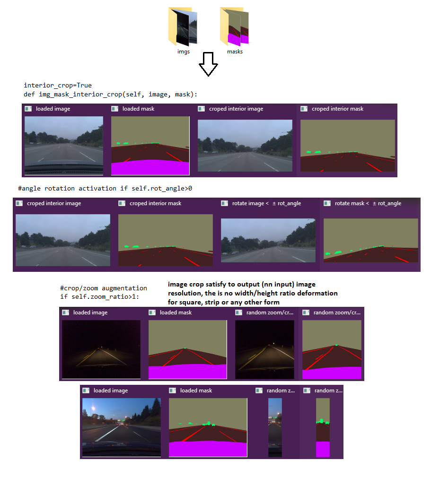

# UNET MASKS AUGMENTATOR

This project is good startup for NN architecture tests with [comma10k dataset](https://github.com/commaai/comma10k).
Just put full imgs and mask folders here from it.
And run <pre>NN.py</pre> to train any NN architecture you want.
It contains Generator class with all required functions for training NN (augmentation, mask transform and labeling classes), and can visualize NN results on real car driving videos from dash cam.
This class automatically rotates the images and their masks on the random angle, randomly horizontally flips them, the images can be cropped and zoomed on the random/fixed size.

The full resolution images (874x1164) and their masks can be also automatically resized to any smaller resolution for keras.fit method. The resolution of masks can be proportionally smaller then corresponding images.

Also the car interior can be cropped from images and masks so the classification tasks become less on the car interior class.
See comments in <pre>generator.py</pre> to see all functions and  augmentation class parameters that can be set.

